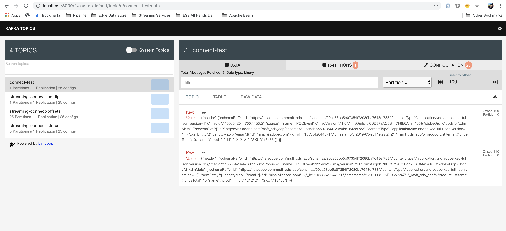

# Developer Guide

The docker setup comes with a full stack of Kafka tools and utilities including Kafka Connect

* Kafka broker
* Zookeeper
* Kafka Rest proxy
* Kafka Topics UI
* Kafka Connect, with the AEP Sink Connector installed.

Once the docker is running, you should be able to test the entire setup using a rest api to insert the message into
your local docker kafka topic.


## Build Docker locally and Run
```shell
./gradlew clean build
docker build -t streaming-connect .
docker compose up -d
```

## Configuration Options

The AEP connector is a uber jar containing all the classfiles and its third-party dependencies.
To install the connector, drop the jar file into the plug in directory of Kafka connect installation.

AEP Sink connector configurations can be supplied in the call register the connector.


| Config Name                       | Description                                     | Default                                                 | Required | Example                 |
|-----------------------------------|-------------------------------------------------|---------------------------------------------------------|----------|-------------------------|
| topics                            | comma separated list of topics                  |                                                         | yes      |                         |
| connector.class                   | classname of impl                               | com.adobe.platform.streaming.sink.impl.AEPSinkConnector | yes      |                         |
| aep.endpoint                      | aep streaming endpoint url                      |                                                         | yes      |                         |
| aep.connection.proxy.host         | address of the proxy host to connect through    |                                                         | no       |                         |
| aep.connection.proxy.port         | port of the proxy host to connect through       | 443                                                     | no       |                         |
| aep.connection.proxy.user         | username for the proxy host                     |                                                         | no       |                         |
| aep.connection.proxy.password     | password for the proxy host                     |                                                         | no       |                         |
| aep.connection.auth.enabled       | required for authenticated streaming endpoint   | false                                                   | no       |                         |
| aep.connection.auth.token.type    | always set to access_token                      | access_token                                            | no       |                         |
| aep.connection.auth.client.id     | IMS client id                                   |                                                         | no       |                         |
| aep.connection.auth.client.code   | IMS client code                                 |                                                         | no       |                         |
| aep.connection.auth.client.secret | IME client secret                               |                                                         | no       |                         |
| aep.flush.bytes.kb                | bytes threshold to determine the batch          | 4                                                       | no       |                         |
| aep.connection.maxRetries         | maxNumber of retries in case of failure from aep streaming endpoint | 3                                   | no       |                         |
| aep.connection.retryBackoff       | retryBackoff in millis while retrying aep streaming endpoint        | 300                                 | no       |                         |


## Step-by-Step Workflow

### Build
```shell
./gradlew clean build
```

### Build docker

```shell
docker build -t streaming-connect .
```

### Running Docker
```shell
docker compose up -d
```

### Tail Docker logs
```shell
docker logs experience-platform-streaming-connect_kafka-connect_1 -f
```

### Manage running connectors

Kafka Connect exposes a set of [REST APIs][connect-apis] to manage
connect instances.

#### List of running connectors

```shell
curl -X GET http://localhost:8083/connectors
```

### Create a Streaming Connection

In order to send streaming data, you must first request a Streaming Connection from Adobe by providing some essential
 properties. Data Inlet Registration APIs are behind adobe.io gateway, so the first step in requesting a new endpoint,
is to either use your existing authentication token and API key combination, or to create a new integration through
[Adobe I/O console][io-console]. More information about adobe.io based authentication is available [here][io-auth]. 

Once you have an IMS access token and API key, it needs to be provided as part of the POST request.

Note that the sandbox-name is optional, if not provided will default to the Production sandbox.


```shell
curl -X POST https://platform.adobe.io/data/foundation/flowservice/connections \
 -H 'Authorization: Bearer {ACCESS_TOKEN}' \
 -H 'Content-Type: application/json' \
 -H 'x-gw-ims-org-id: {IMS_ORG}' \
 -H 'x-api-key: {API_KEY}' \
 -H 'x-sandbox-name: {SANDBOX_NAME}' \
 -d '{
     "name": "Sample Streaming Connection",
     "providerId": "521eee4d-8cbe-4906-bb48-fb6bd4450033",
     "description": "Sample description",
     "connectionSpec": {
         "id": "bc7b00d6-623a-4dfc-9fdb-f1240aeadaeb",
         "version": "1.0"
     },
     "auth": {
         "specName": "Streaming Connection",
         "params": {
             "sourceId": "Sample connection source",
             "dataType": "xdm",
             "name": "Sample connection"
         }
     }
 }
```

If the request was successful a new Streaming Connection should be created for you. The response will looking similar to
the one below. The `id` field in the response is the Connection Id.

```json
{
    "id": "77a05521-91d6-451c-a055-2191d6851c34",
    "etag": "\"a500e689-0000-0200-0000-5e31df730000\""
}
```

With the connection created, you can now retrieve your data collection URL from the connection information.

```shell
curl -X GET https://platform.adobe.io/data/foundation/flowservice/connections/{CONNECTION_ID} \
 -H 'Authorization: Bearer {ACCESS_TOKEN}' \
 -H 'x-gw-ims-org-id: {IMS_ORG}' \
 -H 'x-api-key: {API_KEY}' \
 -H 'x-sandbox-name: {SANDBOX_NAME}'
```

```json
{
    "items": [
        {
            "createdAt": 1583971856947,
            "updatedAt": 1583971856947,
            "createdBy": "{API_KEY}",
            "updatedBy": "{API_KEY}",
            "createdClient": "{USER_ID}",
            "updatedClient": "{USER_ID}",
            "id": "77a05521-91d6-451c-a055-2191d6851c34",
            "name": "Another new sample connection (Experience Event)",
            "description": "Sample description",
            "connectionSpec": {
                "id": "bc7b00d6-623a-4dfc-9fdb-f1240aeadaeb",
                "version": "1.0"
            },
            "state": "enabled",
            "auth": {
                "specName": "Streaming Connection",
                "params": {
                    "sourceId": "Sample connection (ExperienceEvent)",
                    "inletUrl": "https://dcs.adobedc.net/collection/a868e1ce678a911ef1482b083329af3cafa4bafdc781285f25911eaae9e00eb2",
                    "inletId": "a868e1ce678a911ef1482b083329af3cafa4bafdc781285f25911eaae9e00eb2",
                    "dataType": "xdm",
                    "name": "Sample connection (ExperienceEvent)"
                }
            },
            "version": "\"56008aee-0000-0200-0000-5e697e150000\"",
            "etag": "\"56008aee-0000-0200-0000-5e697e150000\""
        }
    ]
}
```

The `inletUrl` in the response above is the AEP Streaming Connection to which the real time events will be getting
sinked to.

### Run AEP Streaming Connector

Once the Connect server is running on port 8083, you can use REST APIs to launch multiple instances of connectors.

#### Basic
```shell
curl -s -X POST \
-H "Content-Type: application/json" \
--data '{
  "name": "aep-sink-connector",
  "config": {
    "connector.class": "com.adobe.platform.streaming.sink.impl.AEPSinkConnector",
    "topics": "connect-test",
    "tasks.max": 1,
    "key.converter": "org.apache.kafka.connect.json.JsonConverter",
    "key.converter.schemas.enable": "false",
    "value.converter": "org.apache.kafka.connect.json.JsonConverter",
    "value.converter.schemas.enable": "false",
    "aep.endpoint": "https://dcs.adobedc.net/collection/{DATA_INLET_ID}"
    "aep.flush.interval.seconds": 1,
    "aep.flush.bytes.kb": 4,
  }
}' http://localhost:8083/connectors
```

#### Authentication Enabled

Use the command below to set up a Sink connector to a Authenticated Streaming Connection:

1. Using access_token
   ```shell
   curl -s -X POST \
   -H "Content-Type: application/json" \
   --data '{
     "name": "aep-auth-sink-connector",
     "config": {
       "connector.class": "com.adobe.platform.streaming.sink.impl.AEPSinkConnector",
       "topics": "connect-test",
       "tasks.max": 1,
       "key.converter": "org.apache.kafka.connect.json.JsonConverter",
       "key.converter.schemas.enable": "false",
       "value.converter": "org.apache.kafka.connect.json.JsonConverter",
       "value.converter.schemas.enable": "false",
       "aep.endpoint": "https://dcs.adobedc.net/collection/{DATA_INLET_ID}",
       "aep.flush.interval.seconds": 1,
       "aep.flush.bytes.kb": 4,       
       "aep.connection.auth.enabled": true,
       "aep.connection.auth.token.type": "access_token",
       "aep.connection.auth.client.id": "<client_id>",
       "aep.connection.auth.client.code": "<client_code>",
       "aep.connection.auth.client.secret": "<client_secret>"
     }
   }' http://localhost:8083/connectors
   ```

2. Using jwt_token
   - Convert private.key from adobe console to PKCS8 private using command
     ```shell
     openssl pkcs8 -topk8 -inform PEM -outform DER -in private.key -out private-pkcs8.key -nocrypt
     ```

   - Create http connector
      ```shell
      curl -s -X POST \
      -H "Content-Type: application/json" \
      --data '{
        "name": "aep-auth-sink-connector",
        "config": {
          "connector.class": "com.adobe.platform.streaming.sink.impl.AEPSinkConnector",
          "topics": "connect-test",
          "tasks.max": 1,
          "key.converter": "org.apache.kafka.connect.json.JsonConverter",
          "key.converter.schemas.enable": "false",
          "value.converter": "org.apache.kafka.connect.json.JsonConverter",
          "value.converter.schemas.enable": "false",
          "aep.endpoint": "https://dcs.adobedc.net/collection/{DATA_INLET_ID}",
          "aep.flush.interval.seconds": 1,
          "aep.flush.bytes.kb": 4,
          "aep.connection.auth.enabled": true,
          "aep.connection.auth.token.type": "jwt_token",
          "aep.connection.auth.client.id": "<client_id>",
          "aep.connection.auth.imsOrg": "<organization-id>",
          "aep.connection.auth.accountKey": "<technical-account-id>",
          "aep.connection.auth.filePath": "<path-to-private-pkcs8.key>",
          "aep.connection.auth.endpoint": "<ims-url>",
          "aep.connection.endpoint.headers": "<optional-header-that-needs-to-be-passed-to-AEP>"
          "aep.connection.auth.client.secret": "<client_secret>"
        }
      }' http://localhost:8083/connectors
      ```
      
     Note - `aep.connection.endpoint.headers` format should be JSON-encoded. 
     Example: To send below 2 HTTP headers - 
     1. key: `x-adobe-flow-id`, value: `341fd4f0-cdec-4912-1ab6-fb54aeb41286`
     2. key: `x-adobe-dataset-id`, value: `3096fbfd5978431948af3ba3`
   
     Use config -
     ```json
     "aep.connection.endpoint.headers": "{\"x-adobe-flow-id\":\"341fd4f0-cdec-4912-1ab6-fb54aeb41286\", \"x-adobe-dataset-id\": \"3096fbfd5978431948af3ba3\"}"
     ```

#### Batching

Use the command below to set up an Sink connector to batch up requests and reduce the number of network calls 

```shell
curl -s -X POST \
-H "Content-Type: application/json" \
--data '{
  "name": "aep-batch-sink-connector",
  "config": {
    "connector.class": "com.adobe.platform.streaming.sink.impl.AEPSinkConnector",
    "topics": "connect-test",
    "tasks.max": 1,
    "key.converter": "org.apache.kafka.connect.json.JsonConverter",
    "key.converter.schemas.enable": "false",
    "value.converter": "org.apache.kafka.connect.json.JsonConverter",
    "value.converter.schemas.enable": "false",
    "aep.endpoint": "https://dcs.adobedc.net/collection/{DATA_INLET_ID}",
    "aep.flush.interval.seconds": 1,
    "aep.flush.bytes.kb": 20,
  }
}' http://localhost:8083/connectors
```

#### Dead Letter Configuration
To send error records to dead letter topic please use standard kafka connector error configuration.

Kafka connect dead letter configurations : `https://docs.confluent.io/platform/current/connect/concepts.html#dead-letter-queue`

#### Poxy host configuration
There are 2 ways to route request to aep endpoint through proxy server :
1. **Using Environment Variable** : Export poxyHost and proxyPort on each kafka node, then restart kafka connect node.
   
    For HTTPS use following :
    ```shell
    export KAFKA_OPTS="-Dhttps.proxyHost=127.0.0.1 -Dhttps.proxyPort=8085 -Dhttps.proxyUser=proxyUsername -Dhttps.proxyPassword=proxyPassword"
    ``` 
    For HTTP use following:
    ```shell
    export KAFKA_OPTS="-Dhttp.proxyHost=127.0.0.1 -Dhttp.proxyPort=8085 -Dhttp.proxyUser=proxyUsername -Dhttp.proxyPassword=proxyPassword"
    ``` 
2. **Using Connector Properties** : While creating connector set following properties, default values mentioned in [connect configurations](#configuration-options).
    ```
    aep.connection.proxy.host                                                          
    aep.connection.proxy.port
    aep.connection.proxy.user
    aep.connection.proxy.password
    ```
For reference, more details are in oracle documentation on configuring proxy settings in java : https://docs.oracle.com/javase/8/docs/technotes/guides/net/proxies.html

#### Use the Kafka Topics UI to view your topics

The docker setup comes with Topics UI to view the topic and messages within.
Open a browser and go to http://localhost:8000 and view the connect-test topic



In order to test the flow, you can use the following curl command to post a message into the Kafka topic using the
Kafka rest proxy. Please ensure that the curl command uses your inlet endpoint, and the schema of the XDM message
corresponding to your setup.

```shell
curl -X POST \
  http://localhost:8082/topics/connect-test \
  -H 'Content-Type: application/vnd.kafka.json.v2+json' \
  -H 'Host: localhost:8082' \
  -d '{
  "records": [{
    "value": {
      "header": {
        "schemaRef": {
          "id": "<schema-id>",
          "contentType": "application/vnd.adobe.xed-full+json;version=1"
        },
        "msgId": "1553542044760:1153:5",
        "source": {
          "name": "POCEvent1122ew2"
        },
        "msgVersion": "1.0",
        "imsOrgId": "0DD379AC5B117F6E0A494106@AdobeOrg"
      },
      "body": {
        "xdmMeta": {
          "schemaRef": {
            "id": "<schema-id>",
            "contentType": "application/vnd.adobe.xed-full+json;version=1"
          }
        },
        "xdmEntity": {
          "identityMap": {
            "email": [{
              "id": "ninair@adobe.com"
            }]
          },
          "_id": "1553542044071",
          "timestamp": "2019-03-25T19:27:24Z",
          "_msft_cds_acp": {
            "productListItems": {
              "priceTotal": 10,
              "name": "prod1",
              "_id": "1212121",
              "SKU": "13455"
            }
          }
        }
      }
    }
  }]
}'
```

You will be able to see the message written to the "connect-test" topic in the Local Kafka cluster, which is picked up 
by the AEP Streaming Sink Connector and sent the AEP Streaming inlet.

[io-auth]: https://www.adobe.io/apis/cloudplatform/console/authentication/gettingstarted.html
[blogpost]: https://medium.com/adobetech/using-postman-for-jwt-authentication-on-adobe-i-o-7573428ffe7f
[connect-apis]: https://docs.confluent.io/current/connect/references/restapi.html
[io-console]: https://console.adobe.io/
[tutorial]: https://github.com/AdobeDocs/experience-platform-docs/blob/master/developer/markdown/narrative/tutorials/authenticate_to_acp_tutorial/authenticate_to_acp_tutorial.md
